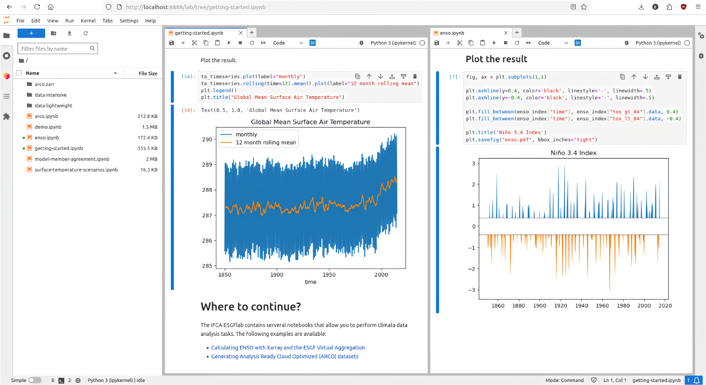

[](https://mybinder.org/v2/gh/zequihg50/science-gateway-esgf/HEAD?labpath=notebooks/getting-started.ipynb) [](https://hub.climate4r.ifca.es/hub/user-redirect/git-pull?repo=https%3A%2F%2Fgithub.com%2Fzequihg50%2Fscience-gateway-esgf&urlpath=lab%2Ftree%2Fscience-gateway-esgf%2Fnotebooks%2Fgetting-started.ipynb)

# ESGF Virtual Aggregation Science Gateway

The ESGF Virtual Aggregation Science Gateway provides Virtual Analysis Ready Data (virtual ARD) for datasets hosted in the ESGF, based on the [ESGF Virtual Aggregation](https://doi.org/10.5194/gmd-18-2461-2025).

## Getting started

Run the science gateway by cliking on the launchers available. The [Binder launcher](https://mybinder.org/v2/gh/zequihg50/science-gateway-esgf/HEAD?labpath=notebooks/getting-started.ipynb) allows to run the science gateway on free computational resources provided by [MyBinder.org](https://mybinder.org). The IFCA launcher is only accesible to users registered in the IFCA Hub.

The [getting started notebook](notebooks/getting-started.ipynb) provides an overview of the science gateway and how to use it. Further notebooks are available in the [notebooks](notebooks) directory.



## Notebooks

The notebooks might be run from any computer system. For a custom installation, refer to the required packages in the [environment.yml](environment.yml) file.

- [Getting started](notebooks/getting-started.ipynb) - Introduction and overview of the science gateway and its capabilities.
- [Model member agreement](notebooks/model-member-agreement.ipynb) - Ilustrates a workflow of model member agreement, based on model member democracy.
- [Analysis-Ready Cloud-Optimized](notebooks/arco.ipynb) - Illustrates how to generate ARCO datasets from the science gateway.
- [Niño 3.4 Index](notebooks/enso.ipynb) - Illustrates the calculation of Niño 3.4 index from the science gateway.

## Setting up a THREDDS Data Server

A THREDDS Data Server (TDS) with access to the ESGF Virtual Aggregation datasets is available at `https://hub.ipcc.ifca.es/thredds`.

Note that you may run your ESGF Virtual Aggregation following the [instructions](https://github.com/zequihg50/esgf-virtual-aggregation). Download the dataset (a tarball) and extract it to the desired location.

You may deploy your own THREDDS Data Server and perform remote data analysis on the ESGF Virtual Aggregation
dataset. The ESGF-VA dataset is available at [Zenodo](https://doi.org/10.5281/zenodo.14987357).

```bash
docker run -p 8080:8080 -v $(pwd)/content:/usr/local/tomcat/content/thredds unidata/thredds-docker:5.0-beta7
```

Now, visit `localhost:8080/thredds` and inspect the server's directory. You may download the NcML from the HTTPServer
endpoint or use the OpenDAP service to get the OpenDAP URL (it should look like `http://localhost:8080/thredds/dodsC/...`).

The OpenDAP service may be used to perform remote data analysis using xarray.

```python
import xarray,dask

dask.config.set(scheduler="processes")

url = "http://localhost:8080/thredds/dodsC/esgeva/demo/CMIP6_CMIP_AS-RCEC_TaiESM1_historical_day_tas_gn_v20200626_esgf.ceda.ac.uk.ncml"
ds = xarray.open_dataset(url).chunk({"time": 100})

# query the size of the dataset on the server side
ds.attrs["size_human"]

# view the variant_label coordinate
ds["variant_label"][...].compute()

# compute spatial mean for all variant_labels
# this involves transferring the necessary data from the server
means = ds["tas"].mean(["lat", "lon"]).compute()
means
```
